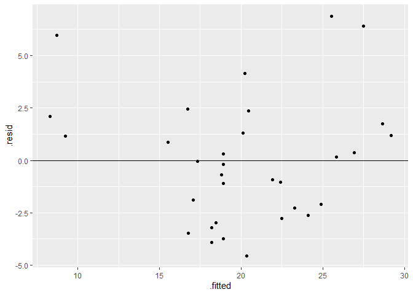
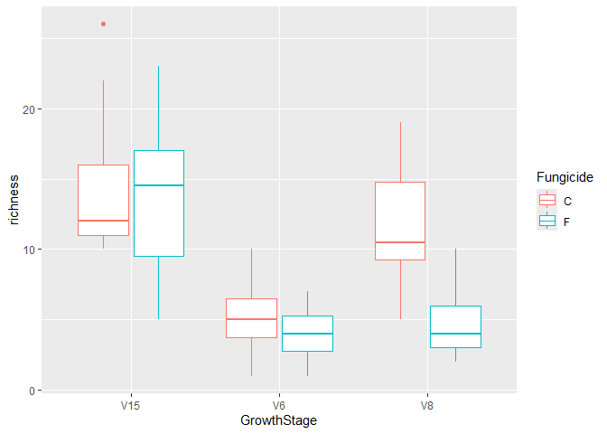

``` r
##Load the data 
data("mtcars")
## Load the required libraries
library(ggplot2)
library(tidyverse)
```

    ## ── Attaching core tidyverse packages ──────────────────────── tidyverse 2.0.0 ──
    ## ✔ dplyr     1.1.4     ✔ readr     2.1.5
    ## ✔ forcats   1.0.0     ✔ stringr   1.5.1
    ## ✔ lubridate 1.9.4     ✔ tibble    3.2.1
    ## ✔ purrr     1.0.2     ✔ tidyr     1.3.1
    ## ── Conflicts ────────────────────────────────────────── tidyverse_conflicts() ──
    ## ✖ dplyr::filter() masks stats::filter()
    ## ✖ dplyr::lag()    masks stats::lag()
    ## ℹ Use the conflicted package (<http://conflicted.r-lib.org/>) to force all conflicts to become errors

## Linear model

``` r
ggplot(mtcars, aes(x = wt, y = mpg)) +
  geom_smooth(method = lm, se = FALSE, color = "grey") +
  geom_point(aes(color = wt)) +
  xlab("Weight") + 
  ylab("Miles per gallon") +
  scale_colour_gradient(low = "forestgreen", high = "black") +
  theme_classic()
```

    ## `geom_smooth()` using formula = 'y ~ x'

<!-- -->

``` r
###has strong positive relation. We know the relation is not random by using the linear model. 
lm1<-lm(mpg~wt, data=mtcars)   ### gives the estimates of our intercept

summary(lm1)
```

    ## 
    ## Call:
    ## lm(formula = mpg ~ wt, data = mtcars)
    ## 
    ## Residuals:
    ##     Min      1Q  Median      3Q     Max 
    ## -4.5432 -2.3647 -0.1252  1.4096  6.8727 
    ## 
    ## Coefficients:
    ##             Estimate Std. Error t value Pr(>|t|)    
    ## (Intercept)  37.2851     1.8776  19.858  < 2e-16 ***
    ## wt           -5.3445     0.5591  -9.559 1.29e-10 ***
    ## ---
    ## Signif. codes:  0 '***' 0.001 '**' 0.01 '*' 0.05 '.' 0.1 ' ' 1
    ## 
    ## Residual standard error: 3.046 on 30 degrees of freedom
    ## Multiple R-squared:  0.7528, Adjusted R-squared:  0.7446 
    ## F-statistic: 91.38 on 1 and 30 DF,  p-value: 1.294e-10

``` r
##anova is used for multiple categorical variable. 
anova(lm1)
```

    ## Analysis of Variance Table
    ## 
    ## Response: mpg
    ##           Df Sum Sq Mean Sq F value    Pr(>F)    
    ## wt         1 847.73  847.73  91.375 1.294e-10 ***
    ## Residuals 30 278.32    9.28                      
    ## ---
    ## Signif. codes:  0 '***' 0.001 '**' 0.01 '*' 0.05 '.' 0.1 ' ' 1

``` r
## correlation analysis 
cor.test(mtcars$wt,mtcars$mpg)
```

    ## 
    ##  Pearson's product-moment correlation
    ## 
    ## data:  mtcars$wt and mtcars$mpg
    ## t = -9.559, df = 30, p-value = 1.294e-10
    ## alternative hypothesis: true correlation is not equal to 0
    ## 95 percent confidence interval:
    ##  -0.9338264 -0.7440872
    ## sample estimates:
    ##        cor 
    ## -0.8676594

``` r
##ALl these test are basically running the linear regression in the background. 
```

``` r
model <- lm(mpg~wt, data = mtcars)

ggplot(model, aes(y = .resid, x = .fitted)) +
  geom_point() +
  geom_hline(yintercept = 0)
```

<!-- -->

``` r
bull.rich<-read.csv("Linear_model/Bull_richness.csv",na.strings="na")
bull.rich.sub<-bull.rich %>% 
filter(GrowthStage=="V8" & Treatment=="Conv.")

## t-test
t.test(richness~Fungicide,data=bull.rich.sub)
```

    ## 
    ##  Welch Two Sample t-test
    ## 
    ## data:  richness by Fungicide
    ## t = 4.8759, df = 17.166, p-value = 0.0001384
    ## alternative hypothesis: true difference in means between group C and group F is not equal to 0
    ## 95 percent confidence interval:
    ##   4.067909 10.265425
    ## sample estimates:
    ## mean in group C mean in group F 
    ##       11.750000        4.583333

``` r
#linear model
summary(lm(richness~Fungicide,data=bull.rich.sub))
```

    ## 
    ## Call:
    ## lm(formula = richness ~ Fungicide, data = bull.rich.sub)
    ## 
    ## Residuals:
    ##     Min      1Q  Median      3Q     Max 
    ## -6.7500 -1.7500 -0.6667  2.2500  7.2500 
    ## 
    ## Coefficients:
    ##             Estimate Std. Error t value Pr(>|t|)    
    ## (Intercept)   11.750      1.039  11.306 1.24e-10 ***
    ## FungicideF    -7.167      1.470  -4.876 7.12e-05 ***
    ## ---
    ## Signif. codes:  0 '***' 0.001 '**' 0.01 '*' 0.05 '.' 0.1 ' ' 1
    ## 
    ## Residual standard error: 3.6 on 22 degrees of freedom
    ## Multiple R-squared:  0.5194, Adjusted R-squared:  0.4975 
    ## F-statistic: 23.77 on 1 and 22 DF,  p-value: 7.118e-05

``` r
anova(lm(richness~Fungicide,data=bull.rich.sub))
```

    ## Analysis of Variance Table
    ## 
    ## Response: richness
    ##           Df Sum Sq Mean Sq F value    Pr(>F)    
    ## Fungicide  1 308.17 308.167  23.774 7.118e-05 ***
    ## Residuals 22 285.17  12.962                      
    ## ---
    ## Signif. codes:  0 '***' 0.001 '**' 0.01 '*' 0.05 '.' 0.1 ' ' 1

``` r
bull.rich.sub2 <- bull.rich %>%
  filter(Fungicide == "C" & Treatment == "Conv." & Crop == "Corn")
#bull.rich.sub2$GrowthStage <- #factor(bull.rich.sub2$GrowthStage, levels = c("V6", "V8", "V15"))

ggplot(bull.rich.sub2, aes(x = GrowthStage, y = richness)) +
  geom_boxplot()
```

<!-- -->

``` r
summary(lm(richness~GrowthStage, data=bull.rich.sub2))
```

    ## 
    ## Call:
    ## lm(formula = richness ~ GrowthStage, data = bull.rich.sub2)
    ## 
    ## Residuals:
    ##    Min     1Q Median     3Q    Max 
    ## -6.750 -2.625 -1.000  2.250 11.583 
    ## 
    ## Coefficients:
    ##               Estimate Std. Error t value Pr(>|t|)    
    ## (Intercept)     14.417      1.208  11.939 1.60e-13 ***
    ## GrowthStageV6   -9.167      1.708  -5.368 6.23e-06 ***
    ## GrowthStageV8   -2.667      1.708  -1.562    0.128    
    ## ---
    ## Signif. codes:  0 '***' 0.001 '**' 0.01 '*' 0.05 '.' 0.1 ' ' 1
    ## 
    ## Residual standard error: 4.183 on 33 degrees of freedom
    ## Multiple R-squared:  0.4803, Adjusted R-squared:  0.4488 
    ## F-statistic: 15.25 on 2 and 33 DF,  p-value: 2.044e-05

``` r
lm3<-lm(richness~GrowthStage, data=bull.rich.sub2)
```

## emmeans

``` r
library(emmeans)
```

    ## Welcome to emmeans.
    ## Caution: You lose important information if you filter this package's results.
    ## See '? untidy'

``` r
library(multcomp)
```

    ## Loading required package: mvtnorm

    ## Loading required package: survival

    ## Loading required package: TH.data

    ## Loading required package: MASS

    ## 
    ## Attaching package: 'MASS'

    ## The following object is masked from 'package:dplyr':
    ## 
    ##     select

    ## 
    ## Attaching package: 'TH.data'

    ## The following object is masked from 'package:MASS':
    ## 
    ##     geyser

``` r
sessionInfo()
```

    ## R version 4.4.2 (2024-10-31 ucrt)
    ## Platform: x86_64-w64-mingw32/x64
    ## Running under: Windows 11 x64 (build 26100)
    ## 
    ## Matrix products: default
    ## 
    ## 
    ## locale:
    ## [1] LC_COLLATE=English_United States.utf8 
    ## [2] LC_CTYPE=English_United States.utf8   
    ## [3] LC_MONETARY=English_United States.utf8
    ## [4] LC_NUMERIC=C                          
    ## [5] LC_TIME=English_United States.utf8    
    ## 
    ## time zone: America/Chicago
    ## tzcode source: internal
    ## 
    ## attached base packages:
    ## [1] stats     graphics  grDevices utils     datasets  methods   base     
    ## 
    ## other attached packages:
    ##  [1] multcomp_1.4-28 TH.data_1.1-3   MASS_7.3-61     survival_3.7-0 
    ##  [5] mvtnorm_1.3-3   emmeans_1.10.7  lubridate_1.9.4 forcats_1.0.0  
    ##  [9] stringr_1.5.1   dplyr_1.1.4     purrr_1.0.2     readr_2.1.5    
    ## [13] tidyr_1.3.1     tibble_3.2.1    tidyverse_2.0.0 ggplot2_3.5.1  
    ## 
    ## loaded via a namespace (and not attached):
    ##  [1] sandwich_3.1-1     generics_0.1.3     stringi_1.8.4      lattice_0.22-6    
    ##  [5] hms_1.1.3          digest_0.6.37      magrittr_2.0.3     evaluate_1.0.3    
    ##  [9] grid_4.4.2         timechange_0.3.0   estimability_1.5.1 fastmap_1.2.0     
    ## [13] Matrix_1.7-1       mgcv_1.9-1         scales_1.3.0       codetools_0.2-20  
    ## [17] cli_3.6.3          rlang_1.1.4        munsell_0.5.1      splines_4.4.2     
    ## [21] withr_3.0.2        yaml_2.3.10        tools_4.4.2        tzdb_0.4.0        
    ## [25] colorspace_2.1-1   vctrs_0.6.5        R6_2.5.1           zoo_1.8-12        
    ## [29] lifecycle_1.0.4    pkgconfig_2.0.3    pillar_1.10.1      gtable_0.3.6      
    ## [33] glue_1.8.0         xfun_0.49          tidyselect_1.2.1   rstudioapi_0.17.1 
    ## [37] knitr_1.49         xtable_1.8-4       farver_2.1.2       htmltools_0.5.8.1 
    ## [41] nlme_3.1-166       rmarkdown_2.29     labeling_0.4.3     compiler_4.4.2

``` r
##emmenas for pairwise comparision
lsmeans<-emmeans(lm3, ~GrowthStage)
results_lsmeans<-cld(lsmeans,alpha=0.05, details=T)
### groups that do show different number are significantly different than each other. 
```

``` r
bull.rich.sub3 <- bull.rich %>%
  filter(Treatment == "Conv." & Crop == "Corn")

#bull.rich.sub3$GrowthStage <- factor(bull.rich.sub3$GrowthStage, levels = c("V6", "V8", "V15"))
lm.interaction<-lm(richness~GrowthStage*Fungicide, data=bull.rich.sub3)
summary(lm.interaction)
```

    ## 
    ## Call:
    ## lm(formula = richness ~ GrowthStage * Fungicide, data = bull.rich.sub3)
    ## 
    ## Residuals:
    ##     Min      1Q  Median      3Q     Max 
    ## -8.5000 -2.4167 -0.4167  2.0625 11.5833 
    ## 
    ## Coefficients:
    ##                          Estimate Std. Error t value Pr(>|t|)    
    ## (Intercept)               14.4167     1.1029  13.072  < 2e-16 ***
    ## GrowthStageV6             -9.1667     1.5597  -5.877 1.51e-07 ***
    ## GrowthStageV8             -2.6667     1.5597  -1.710   0.0920 .  
    ## FungicideF                -0.9167     1.5597  -0.588   0.5587    
    ## GrowthStageV6:FungicideF  -0.3333     2.2057  -0.151   0.8803    
    ## GrowthStageV8:FungicideF  -6.2500     2.2057  -2.834   0.0061 ** 
    ## ---
    ## Signif. codes:  0 '***' 0.001 '**' 0.01 '*' 0.05 '.' 0.1 ' ' 1
    ## 
    ## Residual standard error: 3.82 on 66 degrees of freedom
    ## Multiple R-squared:  0.5903, Adjusted R-squared:  0.5593 
    ## F-statistic: 19.02 on 5 and 66 DF,  p-value: 1.144e-11

``` r
anova(lm.interaction)
```

    ## Analysis of Variance Table
    ## 
    ## Response: richness
    ##                       Df  Sum Sq Mean Sq F value    Pr(>F)    
    ## GrowthStage            2 1065.58  532.79 36.5027 2.113e-11 ***
    ## Fungicide              1  174.22  174.22 11.9363 0.0009668 ***
    ## GrowthStage:Fungicide  2  148.36   74.18  5.0823 0.0088534 ** 
    ## Residuals             66  963.33   14.60                      
    ## ---
    ## Signif. codes:  0 '***' 0.001 '**' 0.01 '*' 0.05 '.' 0.1 ' ' 1

``` r
lsmeans<-emmeans(lm.interaction, ~Fungicide| GrowthStage)  ##3effect of fungicide on growthstage.
results_lsmeans<-cld(lsmeans,alpha=0.05, details=T)

ggplot(bull.rich.sub3, aes(x=GrowthStage, y=richness,colour=Fungicide))+
  geom_boxplot()
```

<!-- -->

## Mixed effect models

In mixed-effects models, we have fixed and random effects terms. The
random effects term is something that affects the variation in y. A
fixed effect is something that affects the mean of y. There are NO rules
that determine what is a fixed or random effect.

``` r
library(lme4)
```

    ## Loading required package: Matrix

    ## 
    ## Attaching package: 'Matrix'

    ## The following objects are masked from 'package:tidyr':
    ## 
    ##     expand, pack, unpack

``` r
#lme0 <- lm(richness ~ GrowthStage*Fungicide, data = bull.rich.sub3)
lm.interaction2 <- lmer(richness ~ GrowthStage*Fungicide + (1|Rep), data = bull.rich.sub3)   ### Rep is the random variable here. 
summary(lm.interaction2)
```

    ## Linear mixed model fit by REML ['lmerMod']
    ## Formula: richness ~ GrowthStage * Fungicide + (1 | Rep)
    ##    Data: bull.rich.sub3
    ## 
    ## REML criterion at convergence: 378.3
    ## 
    ## Scaled residuals: 
    ##     Min      1Q  Median      3Q     Max 
    ## -2.4664 -0.5966 -0.1788  0.6257  2.9101 
    ## 
    ## Random effects:
    ##  Groups   Name        Variance Std.Dev.
    ##  Rep      (Intercept)  0.7855  0.8863  
    ##  Residual             13.9533  3.7354  
    ## Number of obs: 72, groups:  Rep, 4
    ## 
    ## Fixed effects:
    ##                          Estimate Std. Error t value
    ## (Intercept)               14.4167     1.1658  12.366
    ## GrowthStageV6             -9.1667     1.5250  -6.011
    ## GrowthStageV8             -2.6667     1.5250  -1.749
    ## FungicideF                -0.9167     1.5250  -0.601
    ## GrowthStageV6:FungicideF  -0.3333     2.1566  -0.155
    ## GrowthStageV8:FungicideF  -6.2500     2.1566  -2.898
    ## 
    ## Correlation of Fixed Effects:
    ##             (Intr) GrwSV6 GrwSV8 FngcdF GSV6:F
    ## GrowthStgV6 -0.654                            
    ## GrowthStgV8 -0.654  0.500                     
    ## FungicideF  -0.654  0.500  0.500              
    ## GrwthSV6:FF  0.462 -0.707 -0.354 -0.707       
    ## GrwthSV8:FF  0.462 -0.354 -0.707 -0.707  0.500

``` r
summary(lm.interaction)
```

    ## 
    ## Call:
    ## lm(formula = richness ~ GrowthStage * Fungicide, data = bull.rich.sub3)
    ## 
    ## Residuals:
    ##     Min      1Q  Median      3Q     Max 
    ## -8.5000 -2.4167 -0.4167  2.0625 11.5833 
    ## 
    ## Coefficients:
    ##                          Estimate Std. Error t value Pr(>|t|)    
    ## (Intercept)               14.4167     1.1029  13.072  < 2e-16 ***
    ## GrowthStageV6             -9.1667     1.5597  -5.877 1.51e-07 ***
    ## GrowthStageV8             -2.6667     1.5597  -1.710   0.0920 .  
    ## FungicideF                -0.9167     1.5597  -0.588   0.5587    
    ## GrowthStageV6:FungicideF  -0.3333     2.2057  -0.151   0.8803    
    ## GrowthStageV8:FungicideF  -6.2500     2.2057  -2.834   0.0061 ** 
    ## ---
    ## Signif. codes:  0 '***' 0.001 '**' 0.01 '*' 0.05 '.' 0.1 ' ' 1
    ## 
    ## Residual standard error: 3.82 on 66 degrees of freedom
    ## Multiple R-squared:  0.5903, Adjusted R-squared:  0.5593 
    ## F-statistic: 19.02 on 5 and 66 DF,  p-value: 1.144e-11

``` r
lsmeans<-emmeans(lm.interaction2, ~Fungicide|GrowthStage)
results_lsmeans<-cld(lsmeans,alpha=0.05, details=T)
```
